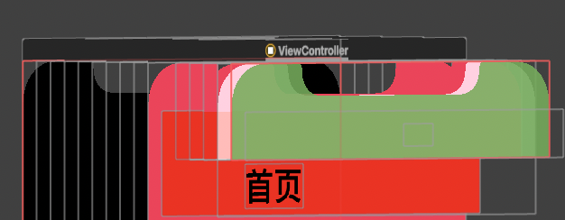
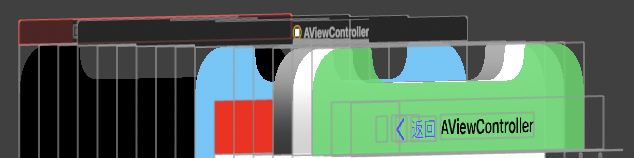

## **一.设置NavigationBar上的title的颜色以及属性**

**a)** *[[UINavigationBar appearance] setTitleTextAttributes:@{NSForegroundColorAttributeName:[UIColor whiteColor]}];*

**b)** [self.navigationController.navigationBar setTitleTextAttributes:@{NSForegroundColorAttributeName:[UIColor whiteColor]}];

## **二、设置NavigationBar背景颜色：**

1、 backgroundColor （red）: 作用于最下方的view（高度为44），图1设置了largeTitle，所以顶部显示barTintColor的view隐藏了，所以可以看到backGroundColor。 图2给导航栏设置一个透明背景图片就可以看到。

2、bartintColor（green）:  作用于navigationbar最上方的view,覆盖到整个navigationbar。在iOS15以下bartintColor无效，因为没有上层的view了。可以看到默认高度使用的standardAppearance下上面的view使用的就是barTintColor.

3、推荐方法：setBackgroundImage:forBarMetrics ,通过设置纯色图片。还可以对图片进行透明度和颜色的改变，这种方案比较灵活。

4、**设置背景色问题**

1、translucent == true: 调用setBackgroundColor方法. ( 要设置navigationbar背景图片为透明才能生效 )，此时导航栏会覆盖到View

2、translucent == false : 调用setBackgroundImage:forBarMetrics方法. 并且有三点需要注意：

​      1、设置透明效果时，可以直接设置[UIImage new]. 

​      2、setBackgroundImage:forBarMetrics，如果图像里存在alpha小于0.1的像素点，则translucent的值为true，反之为false。如果想让导航栏变为真正的纯色，需确保图片的所有像素点 alpha == 1.0;

​      3、如果设置了一个完全不透明的图片，并且设置 translucent == true时，系统会自动修正这个图片，并为它添加一个透明度，模拟transluction效果。

​      4、如果设置了带透明效果的图片，并且translucent == false时，系统会在这个图片背后添加一个不透明的纯色图片用于整体效果的合成。颜色取决于barStyle属性，UIBarStyleBlack为黑色，UIBarStyleDefault为白色，如果有**barTintColor**则以它**优先**。

​         但是如果后面手动改变 translucent == true。系统还是会自动设置一个白色半透明的效果。

总结：transluction在设置颜色或纯色图片后再调用，尽量不要在其他地方调用了。

## **三、设置NavigationItem的颜色**

1、通过设ttintcolor: 修改navigationItem里面的字体颜色,  NavigationItem包括 left、right、backButtonItem。

2、如果barButtonItem中设置了customView，比如custom为button，并且为这个button设置了文本颜色，则以button的字体颜色优先

## 四、设置返回按钮

一、假设页面 A push 到 B，返回按钮显示的优先级为 ( leftBarbuttonItem > backButtonItem > defaultBackItem )：

1、如果B视图有一个自定义的左侧按钮（leftBarButtonItem），则会显示这个自定义按钮；

2、如果B没有自定义按钮，但是A视图的backBarButtonItem属性有自定义项，则显示这个自定义项；

3、如果前2条都没有，则默认显示一个后退按钮，后退按钮的标题是A视图的标题；

二、定义leftBarButtonItem的问题：

1、直接设置leftBarbuttonItem / leftBarbuttonItems，默认代替了backButtonItem， 则滑动手势**会失效**。

2、如果开启了**leftItemsSupplementBackButton**，则**backbutton**会一直保留，leftbutton会添加到backButtomItem右边。手势**不会失效.**则BackButtonItem决定了返回手势是否失效。

三、⚠️：在当前页面设置backButton只会在**下一个页面**生效，如果是设置leftButton则在当前页面生效，如果需要全局设置，则需要用基类或通过运行时对每个页面进行修改。

## 五、导航栏渐变

1、如上第三点所述，我们一般通过barTintColor或backgroundImage设置背景颜色，此时系统会设置顶层的view以达到预期效果，因此通过获取navigationbar.subview.first 设置alpha即可

