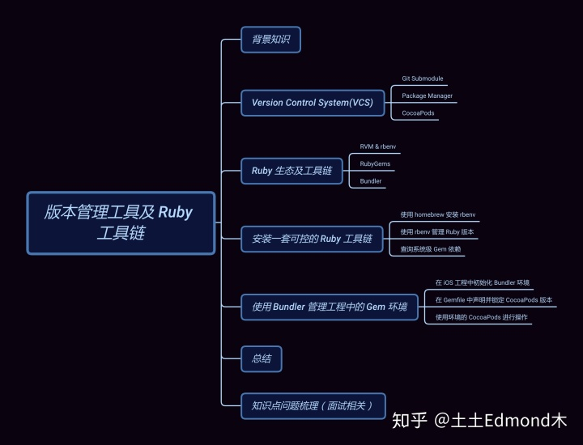
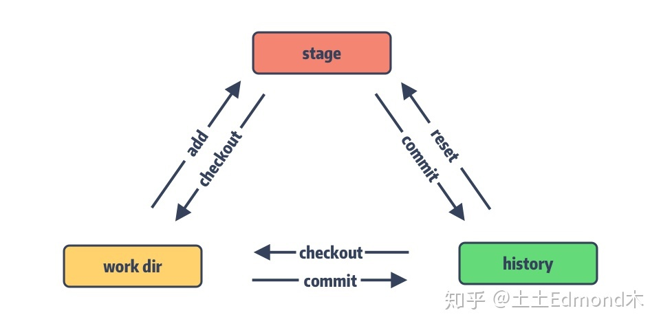
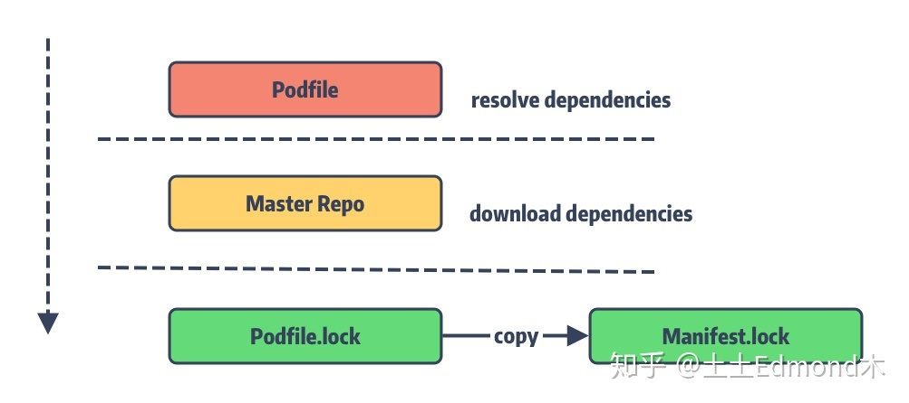
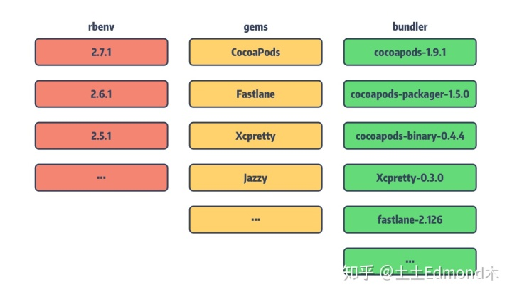
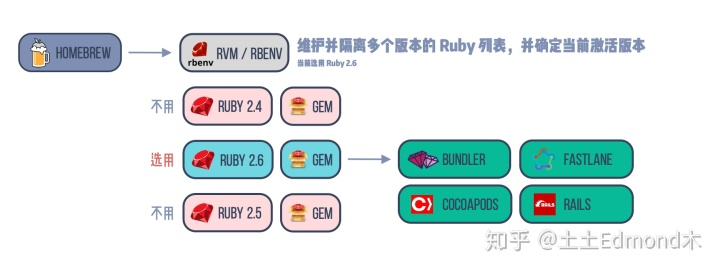
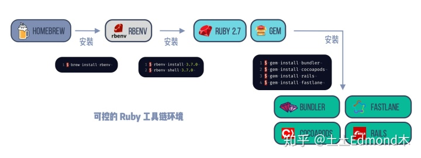
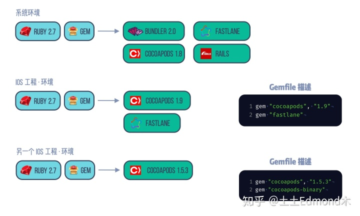

原链接：https://zhuanlan.zhihu.com/p/147537112



# **一、Version Control System (VCS)**

软件工程中，版本控制系统是敏捷开发的重要一环，为后续的持续集成提供了保障。

Source Code Manager (SCM) ： 源码管理就属于 VCS 的范围之中，熟知的工具有如 Git 。

CocoaPods： 这种针对各种语言所提供的 Package Manger (PM)也可以看作是 SCM 的一种。

​    而像 Git 或 SVN 是针对项目的**单个文件**的进行版本控制，而 PM 则是以**每个独立的 Package** 作为最小的管理单元。包管理工具都是结合 SCM 来完成管理工作，对于被 PM 接管的依赖库的文件，通常会在 Git 的 .ignore 文件中选择忽略它们。

例如：在 Node 项目中一般会把 node_modules 目录下的文件 ignore 掉，在 iOS / macOS 项目则是 Pods。


## **1.1、Git SubModules** 

**Git Submodules** **可以算是 PM 的“青春版”，它将单独的 git 仓库以子目录的形式嵌入在工作目录中**。它不具备 PM 工具所特有的语义化版本[2]管理、无法处理依赖共享与冲突等。只能保存每个依赖仓库的文件状态。

Git 在提交更新时，会对所有文件制作一个快照并将其存在数据库中。Git 管理的文件存在 3 种状态：

\* working director： 工作目录，即我们肉眼可见的文件

\* stage area： 暂存区 (或称 index area )，存在 .git/index 目录下，保存的是执行 git add 相关命令后从  工作目录添加的文件。

* commit history： 提交历史，存在 .git/ 目录下，到这个状态的文件改动算是入库成功，基本不会丢失了。



Git submodule 是依赖 .gitmodules 文件来记录子模块的。

[submodule "ReactNative”]

path = ReactNative

url = https://github.com/facebook/ReactNative.git

.gitmodules 仅记录了 **path 和 url** 以及模块名称的基本信息， 但是我们还需要记录每个 Submodule Repo 的 commit 信息，而这 commit 信息是记录在 .git/modules 目录下。同时被添加到 .gitmodules 中的 path 也会被 git 直接 ignore 掉。


## **1.2、Package Manager**

作为 Git Submodule 的强化版，PM 基本都具备了语义化的版本检查能力，依赖递归查找，依赖冲突解决，以及针对具体依赖的构建能力和二进制包等。简单对比如下：

| **Key File** | **Git submodule** | **CocoaPods** | **SPM**      | **npm**

| **描述文件** | .gitmodules     | Podfile    | Package.swift  | Package.json   

| **锁存文件** | .git/modules    | Podfile.lock | Package.resolved | package-lock.json

从上面可见，PM工具基本围绕两个文件实现包管理：

描述文件：声明了项目的依赖、和版本限制。

锁存文件(Lock文件): 记录依赖包最后一次更新时的全版本列表


## **1.3、CocoaPods** 

**CocoaPods****是开发 iOS/macOS 应用程序的一个第三方库的依赖管理工具。** 利用 CocoaPods，可以定义自己的依赖关系（简称 Pods），以及在整个开发环境中对第三方库的版本管理非常方便。

##### 

- Podfile: podfile是一个文件，以DSL（其实是直接用ruby语法）来描述依赖关系，定义项目所需要的第三方库。
- Podfile.lock: 记录了需要被安装的Pod的每个已安装版本。在团队中可以用过该文件同一项目的依赖库版本。
- Manifest.lock: 这是每次运行 pod install 命令时创建的 Podfile.lock 文件的副本. 如果你遇见过这样的错误 **沙盒文件与 Podfile.lock 文件不同步 (The sandbox is not in sync with the Podfile.lock**)，这是因为 Manifest.lock 文件和 Podfile.lock 文件不一致所引起。**Podfile.lock文件可能会在开发中通过同步其他人的代码发生变动**，因此当开发者拉取代码后，通过比较两个文件可以得知依赖是否有变动。


## 1.4、Master Specs Repo

作为包管理工具，Cocoapods的目标是为开发者提供一个更加集中的生态系统，来提升依赖库的可发现性和参与度。本质上是为了提供更好的检索和查询功能，可惜成为了它的问题之一。因为 `CocoaPods` 通过官方的 **Spec 仓库**来管理这些注册的依赖库。随着不断新增的依赖库导致 Spec 的更新和维护成为了使用者的包袱。

好在这个问题在 1.7.2 版本中已经解决了，`CocoaPods` 提供了 Mater Repo CDN[5] ，可以直接 CDN 到对应的 Pod 地址而无需在通过本地的 Spec 仓库了。同时在 1.8 版本中，官方默认的 Spec 仓库已替换为 CDN，其地址为 [https://cdn.cocoapods.org](https://link.zhihu.com/?target=https%3A//cdn.cocoapods.org)[6]。


## **1.5、Ruby 生态及工具链**

对于一部分仅接触过 `CocoaPods` 的同学，其 PM 可能并不熟悉。其实 `CocoaPods` 的思想借鉴了其他语言的 PM 工具，例：`RubyGems`, `Bundler`, `npm` 和 `Gradle`。

我们知道 `CocoaPods` 是通过 Ruby 语言实现的。它本身就是一个 **`Gem` 包**。理解了 Ruby 的依赖管理有助于我们更好的管理不同版本的 `CocoaPods` 和其他 `Gem`。

#### **rvm & rbenv **管理ruby环境

**这两个都是管理多个ruby环境的工具，能够提供不同版本的ruby环境管理和切换**。

⚠️：这两个不兼容，安装rbenv之前要卸载rvm。



#### **RubyGems** gem包管理工具

**RubyGems是Ruby的一个包管理工具，里面管理着用ruby编写的工具或依赖我们称之为Gem.**

并且 RubyGems 还提供了 Ruby 组件的托管服务，可以集中式的查找和安装 library 和 apps。当我们使用 `gem install xxx` 时，会通过 **rubygems.org** 来查询对应的 Gem Package。而 iOS 日常中的很多工具都是 Gem 提供的，例：**`Bundler`，`fastlane`，`jazzy`，`CocoaPods`** 等。

'比如安装cocoapods： gem install cocoapod'

在默认情况下 Gems 总是下载 library 的最新版本，这无法确保所安装的 library 版本符合我们预期。**因此我们还缺一个工具。**

#### **Bundler** 管理Gem依赖

Bundler (也是一个gem) 通过读取项目中的依赖描述文件 `Gemfile` ，来确定各个 Gems 的版本号或者范围，来提供了稳定的应用环境。当我们使用 `bundle install` 它会生成 `Gemfile.lock` 将当前 librarys 使用的具体版本号写入其中。之后，他人再通过 `bundle install` 来安装 libaray 时则会读取 `Gemfile.lock` 中的 librarys、版本信息等。

#### **Gemfile** gem的spec文件

**可以说 `CocoaPods` 其实是 iOS 版的 RubyGems + Bundler 组合。Bundler 依据项目中的 `Gemfile` 文件来管理 Gem，而 `CocoaPods` 通过 Podfile 来管理 Pod。**

Gemfile 配置如下：

```text
source 'https://gems.example.com' do
  gem 'cocoapods', '1.8.4'是管理 Gem 依赖的工具
  gem 'another_gem', :git => 'https://looseyi.github.io.git', :branch => 'master'
end
```

可见，Podfile 的 DSL 写法和 Gemfile 如出一辙。那什么情况会用到 Gemfile 呢 ？

`CocoaPods` 每年都会有一些重大版本的升级，前面聊到过 `CocoaPods` 在 `install` 过程中会对项目的 `.xcodeproj` 文件进行修改，不同版本其有所不同，这些在变更都可能导致大量 `conflicts`，处理不好，项目就不能正常运行了。我想你一定不愿意去修改 `.xcodeproj` 的冲突。

如果项目是基于 `fastlane` 来进行持续集成的相关工作以及 App 的打包工作等，也需要其版本管理等功能。

# 二、**如何安装一套可管控的 Ruby 工具链？**

**我们可以使用 `homebrew` + `rbenv` + `RubyGems` + `Bundler` 这一整套工具链来控制一个工程中 Ruby 工具的版本依赖。**



以rbenv为例：

#### 1、使用homebrew安装rbenv

```text
$ brew install rbenv 
```

#### 2、使用rbenv管理ruby版本

⚠️：安装前需要使用 ruby install -list 查看能用的版本，如果使用beta版可能会一直下载失败。

```text
$ rbenv install 2.7.6 //安装 
```

指定ruby版本生效,如果报错，需要在系统的 .bashrc / .zshrc 中添加 eval "$(rbenv init -)"，然后执行 source ~/.bashrc 生效

```
$ rbenv shell 2.7.6 
```

此时查看ruby， 可以看到ruby是在 rbenv 的管理中了

```
$ which ruby
/Users/gua/.rbenv/shims/ruby
```

查看gem，gem的path也在对应的rbenv中了

```
$ which gem
/Users/bytedance/.rbenv/shims/gem
```

此时查询ruby当前的版本，假设系统版本为2.6.8，rbenv安装的为2.7.6，可以看到里面有系统的ruby和当前使用的ruby

```
mac@MACdeMacBook-Air ~ % rbenv versions   
  system
* 2.7.6 (set by RBENV_VERSION environment variable)
```

如果要切换为系统的，那么执行 rbenv shell system 即可。

#### 3、查询系统级 `Gem` 依赖

如此，我们使用 `rbenv` 已经对 Ruby 及其 `Gem` 环境在版本上进行了环境隔离，通过gem list命令查询系统环境下的所有 Gem 依赖。

```
$ gem list
```

至此，我们完成了全部的ruby 、gem 环境的配置，如下图




#### **4、如何使用 Bundler 管理工程中的 Gem 环境**

使用Bundler可以**锁定项目中的gem环境**，从而让整个团队统一gem环境中的所有ruby工具，避免文件冲突和不必要的错误。**（类比通过podfile锁定各种第三方的版本）**



##### 1、在iOS工程中初始化 Bundler 环境

首先在工程中初始化 bundler 环境（其实就是自动创建一个 Gemfile 环境）

```
$ bundle init
Writing new Gemfile to /Users/Gua/GuaDemo/Gemfile
```

##### 2. 在 `Gemfile` 中声明使用的 `CocoaPods` 版本并安装

之后我们编辑一下这个 `Gemfile` 文件，加入我们当前环境中需要使用 `CocoaPods 1.5.3` 这个版本，则使用 `Gemfile` 的 DSL 编写以下内容：

```
# frozen_string_literal: true

source "https://rubygems.org"

git_source(:github) {|repo_name| "https://github.com/#{repo_name}" }

# gem "rails"
gem "cocoapods", "1.5.3"
```

编写之后执行一下 `bundle install` ：

```
$ bundle install
Fetching gem metadata from https://gems.ruby-china.com/............
Resolving dependencies...
...
Fetching cocoapods 1.5.3
Installing cocoapods 1.5.3
Bundle complete! 1 Gemfile dependency, 30 gems now installed.
```

发现 `CocoaPods 1.5.3` 这个指定版本已经安装成功，并且还保存了一份 `Gemfile.lock` 文件用来锁存这次的依赖结果。

##### 3. 使用当前环境下的 `CocoaPods` 版本操作 iOS 工程

此时检查一下当前 bundler 环境下的 Gem 列表，可以看到这个列表精简了许多，只是一些基础 Gem 依赖和 Cocoapods 的 Gem 依赖。

此时需要使用 **bundle exec pod install** 就可以使用当前环境的 cocoapod 来执行 pod 操作了（当然还需要有podfile），安装成功后在 **podfile.lock 文件可以看到使用的pod版本。**

如果直接使用 pod install 则会使用系统的 cocoapod 进行，由此验证了工程中的 Gem 环境和系统中的环境可以通过bundle 隔离。

# 总结


